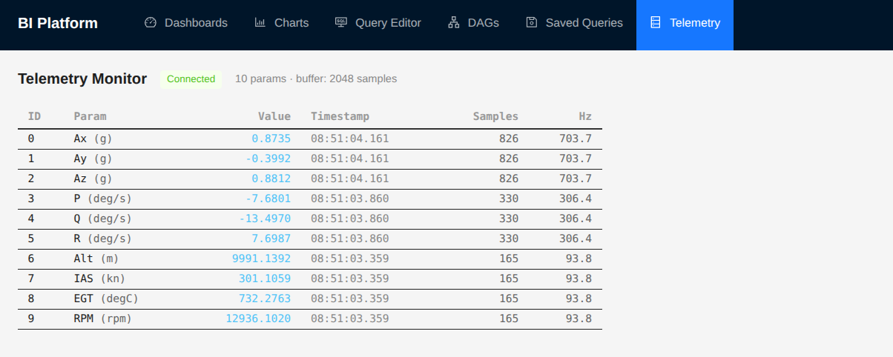

# Low-Latency BI Platform

Real-time data visualization platform — made for high-throughput challenge (flight test telemetry)

## What it does

Streams live telemetry from using socket & web workers and renders it in browser using WebGL compatible visualizations.
Also have react flow for scheduling batch BI queries.



## Architecture

```
Decommutator → Redpanda → Flink (enrich/calibrate) → Redpanda (enriched)
                                                          ↓
                                              Data Nodes (WebSocket)
                                                          ↓
                                              Browser (Web Worker → SharedArrayBuffer → WebGL/Canvas)
```

- **Config Service (REST):** Auth, param catalog, saved layouts, alarm bands
- **Data Nodes (WebSocket):** Consume enriched Redpanda topics, binary-broadcast to browsers
- **Browser:** Web Workers decode binary frames, write to SharedArrayBuffer ring buffers, renderers pull via requestAnimationFrame


## Tech Stack

### Backend
- **Express** — REST API + HTTP server
- **ws** — WebSocket server for binary telemetry broadcast
- **StarRocks** — MPP analytics (BI queries)
- **Couchbase** — Document store (configs, layouts)
- **Redis** — Cache

### Frontend
- **React 18** + **Vite** — UI framework + bundler
- **uPlot** — High-performance 2D time-series charts (strip charts, XY plots)
- **Three.js** + **@react-three/fiber** + **@react-three/drei** — 3D attitude indicator
- **Raw WebGL** — Spectrogram / heatmap rendering
- **Web Workers** + **SharedArrayBuffer** — Off-main-thread data pipeline
- **react-grid-layout** — Draggable/resizable dashboard panels
- **Ant Design** — UI components

### Production Pipeline (not in this repo)
- **Redpanda** — Message broker (Kafka-compatible)
- **Apache Flink** — Stream processing (enrichment, calibration, anomaly detection)
- **Debezium** — CDC from PostgreSQL


Navigate to `http://localhost:5173/telemetry` to see live telemetry streaming.
> **Note:** SharedArrayBuffer requires cross-origin isolation headers. The Vite plugin (`Vite_COOP_COEP_Plugin.js`) handles this in dev.

## Status

- [x] Mock telemetry server (binary WebSocket)
- [x] Web Worker + SharedArrayBuffer ring buffers
- [x] Live param monitor (RAF-driven DOM updates)
- [ ] uPlot strip charts
- [ ] 3D attitude indicator
- [ ] WebGL spectrogram
- [ ] Dashboard layout (react-grid-layout)
- [ ] Subscription/param browser
- [ ] Config service integration